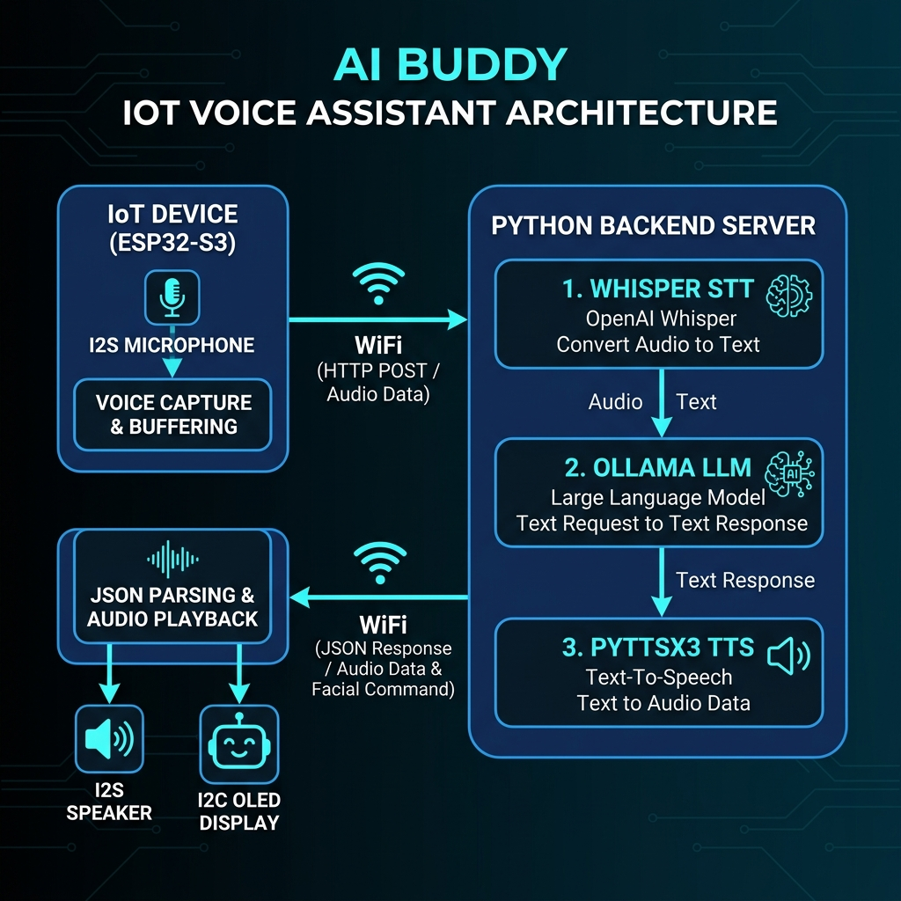

<p align="center">
  
</p>

<h1 align="center">🤖 AI Buddy — Your AI-Powered Desk Companion</h1>

<p align="center">
  <em>An affordable, open-source voice assistant with animated emotions, built on ESP32-S3</em>
</p>

<p align="center">
  
  
  
  
  
</p>

<p align="center">
  
  
  
  
</p>

---

## 📖 Overview

**AI Buddy** is a tiny desk robot that **listens to your voice, thinks, and talks back** — all while showing cute animated facial expressions on a 0.96" OLED display. It runs 100% offline using local AI models, costs under ₹800 to build, and can even control your laptop (open YouTube, check emails, take notes).

Think of it as your own personal **J.A.R.V.I.S.** — minus the billion-dollar suit.

### ✨ Key Highlights

| Feature | Details |
|---|---|
| 🎤 **Voice-Activated** | No button needed — starts recording when you speak |
| 🧠 **Multi-LLM Support** | Ollama (offline), Google Gemini, or OpenAI |
| 😊 **8 Animated Emotions** | Neutral, Happy, Sad, Angry, Listening, Thinking, Speaking, Sleepy |
| 🔧 **Task Automation** | Open YouTube, Gmail, take notes, check battery/CPU |
| 💾 **Long-Term Memory** | Remembers facts across conversations |
| 🎭 **4 Personalities** | Snarky, Friendly, Professional, J.A.R.V.I.S. |
| 🔒 **Fully Offline** | All AI processing runs locally on your laptop |
| 💰 **Under ₹800** | Built with common, affordable components |

---

## 🏗️ System Architecture

```
┌─────────────────────────────────────────────────────────────┐
│                    ESP32-S3 Super Mini                       │
│  ┌───────────┐    ┌──────────┐    ┌──────────────────────┐  │
│  │  INMP441  │    │   WiFi   │    │  SSD1306 OLED 128×64 │  │
│  │ Microphone│───▶│ UDP Auto-│    │  Animated Face 😊😢🤔  │  │
│  └───────────┘    │ Discovery│    └──────────▲───────────┘  │
│                   └────┬─────┘               │              │
│  ┌───────────┐         │                     │              │
│  │ MAX98357A │         │                     │              │
│  │I2S Speaker│◀────────┼─────────────────────┘              │
│  └───────────┘         │                                    │
└────────────────────────┼────────────────────────────────────┘
                         │  Raw PCM Audio (16kHz, 16-bit)     │
                         │  + Custom HTTP Headers             │
                         ▼                                    │
┌────────────────────────────────────────────────────────────┐
│                   Python Backend (Laptop)                   │
│                                                            │
│   ┌──────────────┐  ┌──────────────┐  ┌─────────────────┐ │
│   │  Stage 1:    │  │  Stage 2:    │  │   Stage 3:      │ │
│   │  Whisper STT │─▶│  Ollama LLM  │─▶│  pyttsx3 TTS    │ │
│   │  (base.en)   │  │  (llama3.2)  │  │  (binary audio) │ │
│   └──────────────┘  └──────────────┘  └─────────────────┘ │
│                                                            │
│   FastAPI Server (UDP Broadcaster + HTTP)                  │
└────────────────────────────────────────────────────────────┘
```

### How It Works

1. **You speak** → INMP441 microphone captures raw PCM audio
2. **ESP32 sends** audio to the laptop via HTTP POST over WiFi
3. **Whisper** transcribes speech to text (offline, ~1 second)
4. **Ollama** generates an intelligent response with an emotion tag
5. **pyttsx3** synthesizes speech, bypassing the laptop speaker to generate a raw audio stream
6. **ESP32 receives** binary audio directly to its PSRAM via HTTP stream and plays it on the **I2S Speaker**, updating the face simultaneously

---

## 🔌 Hardware

### Components Required

| # | Component | Purpose | 
|---|---|---|
| 1 | ESP32-S3 Super Mini | Main controller + WiFi | 
| 2 | INMP441 Microphone | Digital I2S voice input | 
| 3 | MAX98357A Amplifier | Digital I2S audio output |
| 4 | 3W 4Ohm Mini Speaker | Audio playback |
| 5 | SSD1306 OLED 0.96" (128×64) | Animated face display | 
| 6 | Breadboard + Jumper Wires | Prototyping |

### Wiring Diagram

```
ESP32-S3 Super Mini          INMP441 Microphone
─────────────────           ──────────────────
GPIO 11  (BCLK)  ────────▶  BCLK (Serial Clock)
GPIO 12  (WS)    ────────▶  WS   (Word Select / LRCLK)
GPIO 13  (DATA)  ◀────────  SD   (Serial Data Out)
3V3              ────────▶  VDD
GND              ────────▶  GND
GND              ────────▶  L/R  (Left channel select)


ESP32-S3 Super Mini          SSD1306 OLED Display
─────────────────           ──────────────────────
GPIO 5   (SDA)   ◀───────▶  SDA  (I2C Data)
GPIO 6   (SCL)   ────────▶  SCL  (I2C Clock)
3V3              ────────▶  VCC
GND              ────────▶  GND


ESP32-S3 Super Mini          MAX98357A I2S Amplifier
─────────────────           ───────────────────────
GPIO 1   (BCLK)  ────────▶  BCLK
GPIO 2   (LRC)   ────────▶  LRC
GPIO 4   (DIN)   ────────▶  DIN
5V / VBUS        ────────▶  VIN (Needs 5V for loud audio)
GND              ────────▶  GND
```

---

## 😊 Emotion System

AI Buddy has **8 distinct animated facial expressions**, each with smooth transitions, random eye blinks, and subtle eye drift that makes it feel alive:

| ID | Emotion | Expression | When Triggered |
|---|---|---|---|
| 0 | Neutral | 👀 Normal open eyes | Idle state |
| 1 | Happy | 😊 Squished arcs + blush | Positive responses |
| 2 | Sad | 😢 Droopy eyes + teardrop | Errors or sad topics |
| 3 | Angry | 😠 V-eyebrows + gritted teeth | Frustrated responses |
| 4 | Listening | 👂 Wide eyes + sound waves | Recording audio |
| 5 | Thinking | 🤔 Asymmetric eyes + thought bubble | Processing request |
| 6 | Speaking | 🗣️ Bouncing mouth animation | Playing response |
| 7 | Sleepy | 😴 Half-closed eyes + floating Z's | Late night |

---

## 🎭 Personality Profiles

Switch between 4 built-in personalities via the `.env` file:

| Profile | Style | Best For |
|---|---|---|
| `snarky` | Sarcastic best friend who roasts you but has your back | Fun & entertainment |
| `friendly` | Warm, enthusiastic, and supportive cheerleader | Daily motivation |
| `professional` | Clear, efficient, no-fluff assistant | Productivity |
| `jarvis` | Dry British wit, hyper-efficient butler | Iron Man fans |

---

## 🔧 Task Automation

Voice-controlled laptop actions — just say the command:

| Voice Command | Action |
|---|---|
| *"Play lofi beats on YouTube"* | Opens and plays the first YouTube video result |
| *"Check my email"* | Opens Gmail in browser |
| *"Open LinkedIn"* | Opens LinkedIn |
| *"Open GitHub"* | Opens GitHub |
| *"Take a note saying buy groceries"* | Appends to `AI_Buddy_Notes.txt` on Desktop |
| *"What's my battery level?"* | Reports laptop battery percentage |
| *"What's the CPU usage?"* | Reports current CPU load |
| *"Open my downloads folder"* | Opens File Explorer to Downloads |
| *"Remember that my exam is on May 10"* | Saves fact to persistent memory |

---

## 🚀 Getting Started

### Prerequisites

- **Python 3.10+** installed
- **Arduino IDE 2.x** with ESP32 board support
- **Ollama** installed ([ollama.com](https://ollama.com)) with `llama3.2` model pulled
- A **2.4GHz WiFi** network (ESP32 doesn't support 5GHz)

### 1. Clone the Repository

```bash
git clone https://github.com/YOUR_USERNAME/AI-Buddy.git
cd AI-Buddy
```

### 2. Backend Setup

```bash
cd backend

# Create virtual environment
python -m venv venv
venv\Scripts\activate        # Windows
# source venv/bin/activate   # macOS/Linux

# Install dependencies
pip install -r requirements.txt

# Configure environment
copy .env.example .env
# Edit .env with your settings (WiFi IP, API keys, personality)
```

### 3. Pull the Ollama Model

```bash
ollama pull llama3.2
```

### 4. Flash the Firmware

1. Open `firmware/AI_Buddy/AI_Buddy.ino` in Arduino IDE
2. Edit `config.h`:
   - Set `WIFI_SSID` and `WIFI_PASSWORD` to your 2.4GHz network
   - Set `WS_HOST` to your laptop's local IP (find with `ipconfig`)
3. Select board: **ESP32S3 Dev Module**
4. Settings: USB CDC On Boot → **Enabled**
5. Click **Upload**

### 5. Run!

```bash
# Terminal 1: Start backend
cd backend
python server.py

# The ESP32 will automatically connect and start listening!
```

---

## ⚙️ Configuration

All configuration is done via two files:

### `firmware/AI_Buddy/config.h` (ESP32)

```c
#define WIFI_SSID         "YourNetwork"
#define WIFI_PASSWORD     "YourPassword"
#define WS_HOST           "192.168.1.4"    // Your laptop's IP
#define WS_PORT           8765
#define VOICE_THRESHOLD   1000             // Mic sensitivity (lower = more sensitive)
#define SILENCE_THRESHOLD 600              // Silence detection
#define MAX_RECORD_SECS   4                // Max recording duration
```

### `backend/.env` (Python)

```env
AI_PROVIDER=ollama              # ollama, gemini, or openai
OLLAMA_MODEL=llama3.2           # Any Ollama model
WHISPER_MODEL=base.en           # tiny, base, small, medium, large
PERSONALITY=jarvis              # snarky, friendly, professional, jarvis
```

---

## 📁 Project Structure

```
AI-Buddy/
├── firmware/
│   ├── AI_Buddy/                  # Main firmware
│   │   ├── AI_Buddy.ino           # Main sketch (state machine)
│   │   ├── config.h               # All hardware & network config
│   │   ├── audio_manager.cpp/h    # I2S mic recording & playback
│   │   ├── display_manager.cpp/h  # OLED face animations
│   │   └── http_comm.h            # HTTP communication layer
│   ├── AI_Buddy_Mic_Test/         # Standalone mic test
│   ├── AI_Buddy_OLED_Test/        # Standalone OLED test
│   ├── AI_Buddy_Speaker_Test/     # Standalone speaker test
│   ├── I2C_Scanner/               # I2C address scanner
│   └── WiFi_Test/                 # WiFi connectivity test
│
├── backend/
│   ├── server.py                  # FastAPI HTTP server
│   ├── ai_pipeline.py             # LLM integration + task automation
│   ├── stt_engine.py              # Whisper speech-to-text
│   ├── tts_engine.py              # pyttsx3 text-to-speech
│   ├── personality.py             # 4 personality profiles + emotion parser
│   ├── requirements.txt           # Python dependencies
│   ├── .env.example               # Environment template
│   └── memory.json                # Persistent user memory
│
├── docs/
│   └── images/                    # Architecture diagrams & photos
│
└── README.md
```

---

## 🔍 Troubleshooting

| Problem | Cause | Solution |
|---|---|---|
| `HTTP Failed! Code: -1` | Windows Firewall blocking port 8765 | Disable firewall for Private network, or add inbound rule |
| `Server not reachable` | Backend not running or wrong IP | Verify `WS_HOST` in `config.h` matches `ipconfig` output |
| Mic not picking up voice | Threshold too high | Lower `VOICE_THRESHOLD` in `config.h` (try 800-1200) |
| Picks up background noise | Threshold too low | Raise `VOICE_THRESHOLD` (try 1500-2500) |
| WiFi won't connect | 5GHz network or wrong password | Use 2.4GHz network, verify credentials |
| Whisper transcribes garbage | Audio too quiet | Check INMP441 wiring (L/R pin must be GND for left channel) |
| AI responds with old "Sir" | Server using cached personality | Restart `python server.py` |
| `wifi:sta is connecting` loop | WiFi stack frozen | Press RST button on ESP32 |

---

## 🛣️ Roadmap

- [x] 🔊 Hardware speaker support (MAX98357A + PSRAM binary streaming)
- [x] 📡 UDP Auto-Discovery (zero-configuration network setup)
- [ ] 🗣️ Wake word detection ("Hey Buddy")
- [ ] 🏠 Smart home control via MQTT
- [ ] 📷 Camera module for visual recognition
- [ ] 📱 Bluetooth companion app for settings
- [ ] 🌐 Multi-language support (Hindi, Kannada)
- [ ] 🖨️ 3D-printed enclosure design

---

## 🤝 Contributing

Contributions are welcome! Feel free to:
1. Fork the repository
2. Create a feature branch (`git checkout -b feature/wake-word`)
3. Commit your changes (`git commit -m 'Add wake word detection'`)
4. Push to the branch (`git push origin feature/wake-word`)
5. Open a Pull Request

---

## 📄 License

This project is licensed under the MIT License — see the [LICENSE](LICENSE) file for details.

---

## 🙏 Acknowledgments

- [Ollama](https://ollama.com) — Local LLM inference
- [faster-whisper](https://github.com/guillaumekln/faster-whisper) — Fast speech-to-text
- [Espressif](https://www.espressif.com/) — ESP32-S3 platform
- [Adafruit](https://github.com/adafruit/Adafruit_SSD1306) — SSD1306 OLED library

---

<p align="center">
  <strong>Built with ❤️ and a soldering iron</strong><br/>
  <em>If you liked this project, give it a ⭐!</em>
</p>
